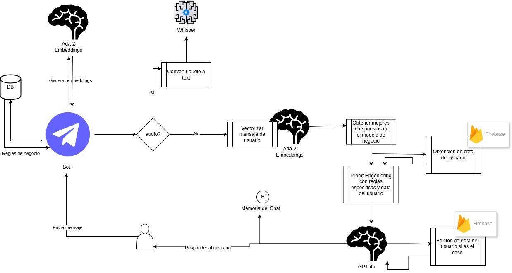
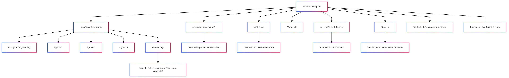
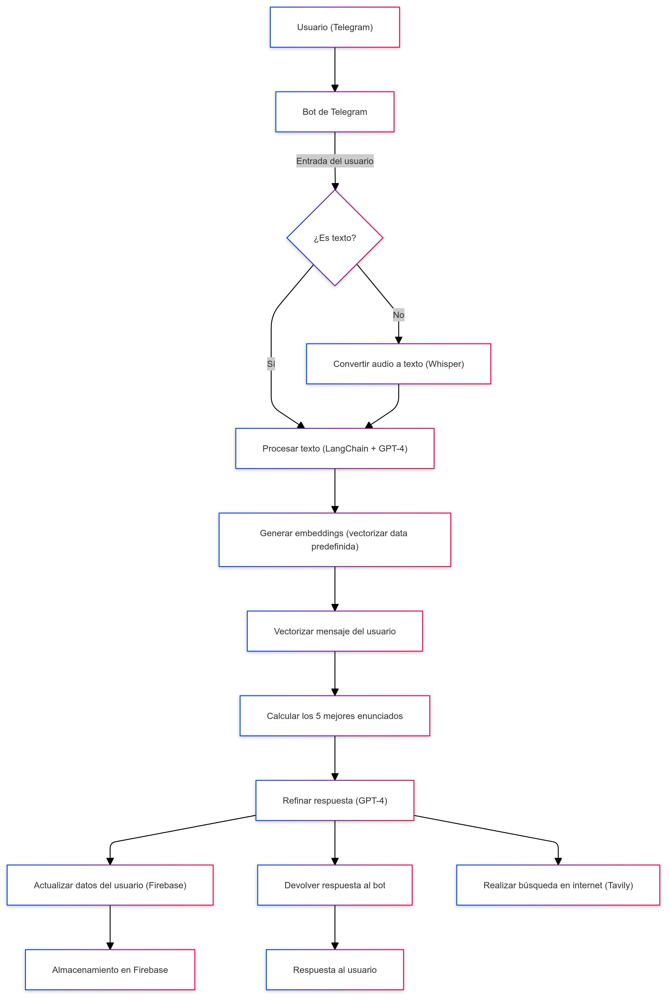
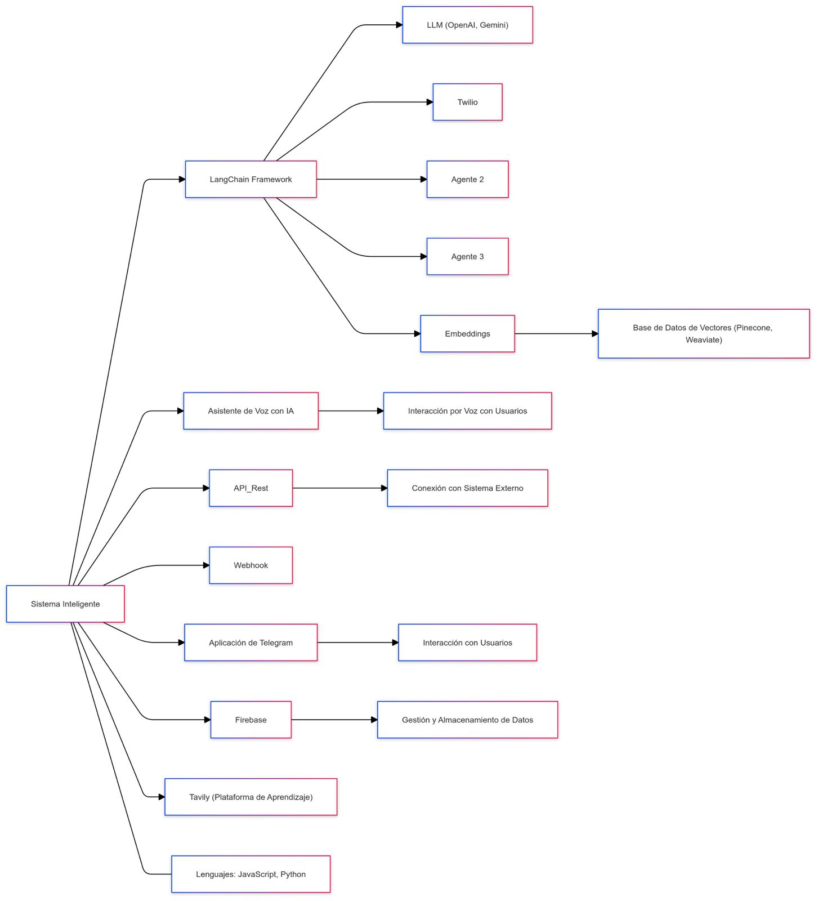

### Arquitectura del proyecto:

### Deploys the application

##  Agent banorte api

* https://asistent-api.onrender.com/docs#

## Agent js voice time real

* https://6c854ba6-f307-4492-bf64-841d4f570fd0-00-3d8k6k8b510fx.picard.replit.dev

## Agent python voice time real

* https://assistant-python.onrender.com

# Url de base de datos de Fire Base:

* https://banorte-hackathon-default-rtdb.firebaseio.com/

